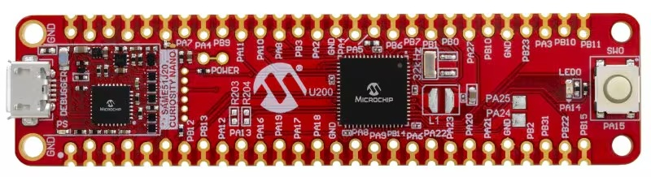
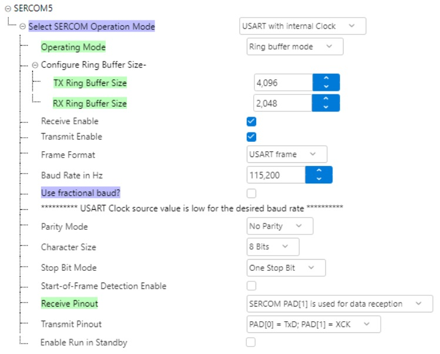
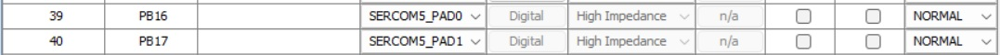
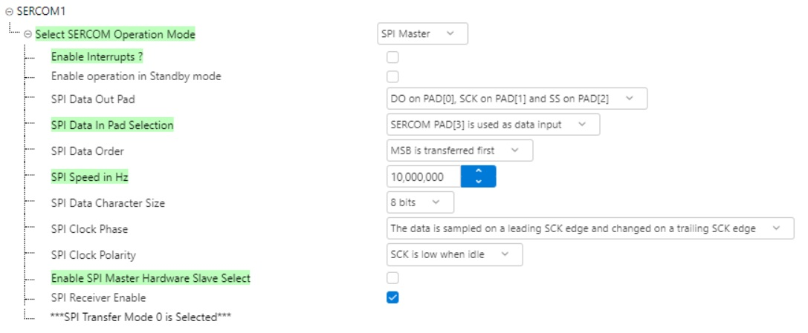
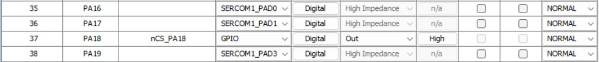
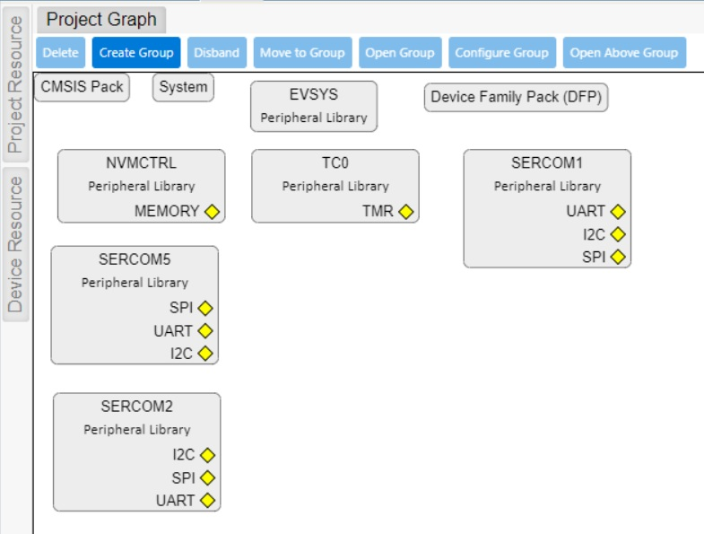

# SAM E51

## Development Board
SAM E51 CURIOSITY NANO


### KIT-INFO.TXT
```
Debugger firmware:     01.1F.0027 (hex)
Kit name:              SAM E51 Curiosity Nano                                      
Kit USB serial number: MCHP3360023000003716
Device:                ATSAME51J20A                    
Drag and drop:         No 
```
### Evaluation Board Details
```
Part Number: EV76S68A
https://www.microchip.com/en-us/development-tool/ev76s68a

ARM® Cortex®-M4 processor - ATSAME51J20A
One user LED (yellow), active low,  PA14 (pin 31)
One user switch, active low,        PA15 (pin 32)
32,768Hz crystal                    PA00 XIN32, PA01 XOUT32
On-board debugger
Board identification in MPLAB X IDE
One power/status LED (green)
Virtual COM port (CDC)
One logic analyzer (DGI GPIO)
USB powered
Adjustable target voltage
MIC5353 LDO regulator controlled by the on-board debugger
1.8-3.6v output voltage
500 mA maximum output current (limited by ambient temperature and output voltage)

Serial/CDC Port - Prewired
The only SERCOM connected to pins 39 and 40 is SERCOM5
```

### SERCOM5 - Serial/CDC Port - Prewired for USB Serial Communication
SERCOM5 is prewired for the USB CDC virtual COM port on this board:
- SERCOM5 TX - PAD0 - PB16 (pin 39)
- SERCOM5 RX - PAD1 - PB17 (pin 40)




### SERCOM1 - SPI interface to external Winbond W25Q128FV (or similar) flash chip
- SERCOM1 - PAD0 - PA16 (pin 33) - SPI MOSI
- SERCOM1 - PAD1 - PA17 (pin 36) - SPI SCK
- nCS_PA18       - PA18 (pin 37) - SPI Chip Select - active low
- SERCOM1 - PAD3 - PA19 (pin 38) - SPI MISO




### SERCOM2 - USART interface for debugging XMODEM/YMODEM (Optional)
- SERCOM2 TX - PAD0 - PA12 (pin 29)
- SERCOM2 RX - PAD1 - PA13 (pin 30)
 
## Timers

### TC0 — 32-bit microsecond counter

`TC0` is configured as a 32-bit timer running at 1 MHz (increments every 1 µs). The current 32-bit counter value can be read from firmware using `TC0_Timer32bitCounterGet()`.

### SYSTICK — millisecond tick counter

The system SYSTICK provides a millisecond tick (increments every 1 ms). The current 32-bit millisecond tick count is available via `SYSTICK_GetTickCounter()`.

## MCC Project Graph


## Build Environment
```
 The build environment for this project consists of this repository cloned into a
 folder structure as follows:

+-- curiosity_nano_same51j20a_cmd_line_littlefs
|   +-- LittleFS.X                            | MPLAB X project directory
|   +-- src                                   | source directory
|       +-- main.c                            | application entry
|       +-- command_line/                     | interactive command parser
|       +-- config/default/                   | MCC/Harmony generated board/peripheral config
|       |   +-- bsp/                          | board support package
|       |   +-- peripheral/                   | clock/cmcc/dwt/evsys/nvic/nvmctrl/port/sercom/systick/tc
|       |   +-- stdio/                        | monitor stdio support
|       +-- ini_store/                        | ini store test module
|       +-- ini_store_v2/                     | ini store v2 implementation
|       +-- littlefs/                         | littlefs and flash interface
|       +-- logger/                           | logging / printf support
|       +-- xmodem/                           | xmodem transfer support
|       +-- ymodem/                           | ymodem transfer support
|       +-- packs/                            | ATSAME51J20A DFP + CMSIS headers
|   +-- README.md                             | this README file
|   +-- CuriosityNanoBoard.jpg                | Curiosity Nano picture
```

### What is this repository for?
```
SAM E5x/D5x (curiosity nano development board)
Demonstrate creating a Command Line project
```
### How do I get set up?
```
Install MplabX IDE v6.25
Install Microhip Compiler, XC32 v4.60
```
    
### Help - Getting Started
```
https://www.microchip.com/en-us/tools-resources/configure/mplab-harmony
https://developerhelp.microchip.com/xwiki/bin/view/software-tools/harmony/archive/same54-getting-started-training-module/

```

### YouTube Videos
```
https://www.youtube.com/watch?v=wZlUVmyrH54

```

### Version Log
```
0.10.0  Add color support to logger
0.9.3   Add cls command.  Add text_in_box()

```
